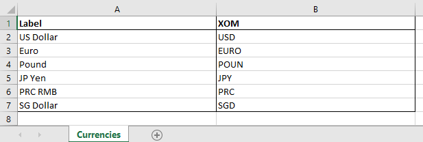
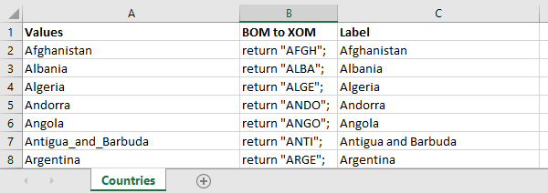

[]

# Decision Center lightweight domain provider
 
 ## Overview
 Lightweight domains are an alternative to dynamic domains, with the following similarities and differences:
 
 > <u>Similarities</u>:
 > - the content of the domain is defined in an Excel file
 > - the business users can update the domain

> <u>Differences</u>:
> - the content of the domain is not imported into the BOM
> - the content of the domain is loaded when needed from the Excel file,
>   - and remains in the memory until it is replaced by another domain.
>   - (up to the 10 most recently loaded domains are kept in memory)
> - any change in the Excel is taken into account automatically
>   - the Excel file is periodically checked for changes when a domain is in the memory
>       - every 10 min when displaying a rule
>       - or every minute when editing a rule
>   - domains are always reloaded when building rules

## Content
This repository contains:
- [lightweight-domain-provider](lightweight-domain-provider) : the source code of the value provider that offers this feature
- [lightweight domain sample](lightweight%20domain%20sample) : a sample using lightweight domains

## Defining a lightweight domain

### Excel file
The Excel file must have at least 2 columns:
- Labels displayed in the rules
- Strings used during the execution  

<u>Example</u>:



### BOM
Unlike dynamic domains, no class is defined for the domain in the BOM.
Instead, the attributes (of type String) whose value should be chosen among the elements of the domain, must have the following custom properties defined:

| Custom Property  | Value | Description |
| - | - | - |
| valueInfo | lightweightdomain  | key name of the lightweight domain provider |
| resource | domains/currencies.xlsx | pathname of the Excel file |

The following custom properties can be defined as well optionally if the default value is not suitable:
| Custom Property  | Value | Description | Default value |
| - | - | - | - |
| labelColumn | integer  | index of the Label column | 0 |
| b2xColumn | integer | index of the XOM column | 1  | 
| hasHeader | true or false | true if the first row should be ignored | true  | 
| sheetIndex | integer | index of the sheet | 0  | 
| format | msexcel2003 or msexcel2007 | format of the Excel file | msexcel2007  | 


## Defining a lightweight domain by reusing a dynamic domain

### Excel file
The Excel file of a dynamic domain has typically the content below:

<u>Example</u>:



> <u>Note</u>: 
> Even though the content of the **BOM to XOM** column is different from what is expected (see the **XOM** column in the previous example), you do not have to modify the content of that column as the lightweight domain provider automatically removes `return "` and `";` to only keep the string, eg. `return "AFGH";` is treated as `AFGH`

### BOM
You can simply copy the custom properties defined on the domain class and paste them to the attribute using the domain.
You also need to define the custom `property valueInfo "lightweightdomain"`

<u>Example</u>:
```java
public class Order
        extends ilog.rules.xml.IlrXmlObject
{
    public string country
                property "com.ibm.rules.domainProvider.msexcel.b2xColumn" "1"
                property "com.ibm.rules.domainProvider.msexcel.hasHeader" "true"
                property "com.ibm.rules.domainProvider.msexcel.labelColumn.en" "2"
                property "com.ibm.rules.domainProvider.msexcel.sheetIndex" "0"
                property "com.ibm.rules.domainProvider.msexcel.valueColumn" "0"
                property domainProviderResource "domains/countries.xlsx"
                property domainValueProviderName "com.ibm.rules.domainProvider.msexcel2007"
                property valueInfo "lightweightdomain";
```
> Note:
>   - the property `com.ibm.rules.domainProvider.msexcel.valueColumn` is optional
>   - all the other properties are mandatory

## Building
### using Maven
* Edit the [pom.xml](lightweight-domain-provider/pom.xml) file to define the dependency to Decision Center Jars and the URL of your remote repository
* Run the maven command:
```
mvn clean install
```
### using Ant
* Edit the [build.properties](lightweight-domain-provider/build.properties) file to set the `odm.dir` property to your ODM install directory.
* Run the default Ant target to build `lightweight-domain-provider.jar`
```
ant -f build.xml
```
## Running
To run the sample, add the JAR generated in the `target` directory to decisioncenter.war (in WEB-INF/lib). 
Deploy the [lightweight domain sample](lightweight%20domain%20sample) and edit rules and Decision Tables in that project. 

# Issues and contributions
For issues relating specifically to the Dockerfiles and scripts, please use the [GitHub issue tracker](../../issues).
We welcome contributions following [our guidelines](CONTRIBUTING.md).

# License
The Dockerfiles and associated scripts found in this project are licensed under the [Apache License 2.0](LICENSE).

# Notice
© Copyright IBM Corporation 2022.